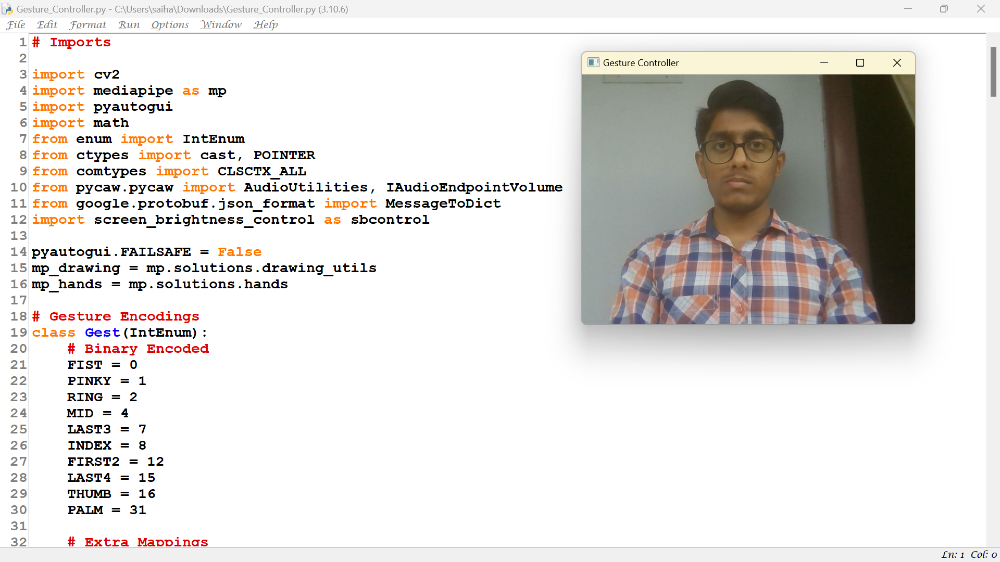
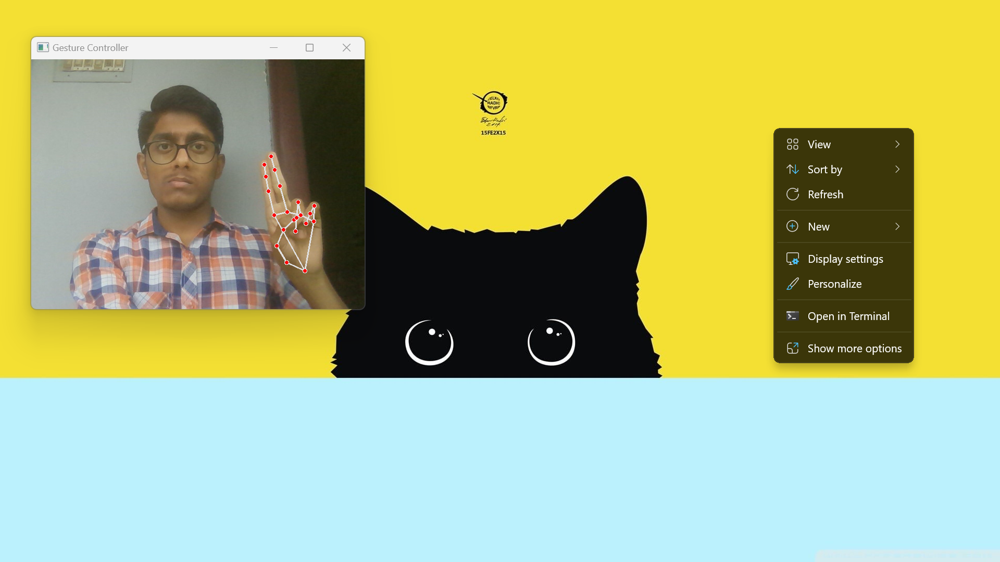
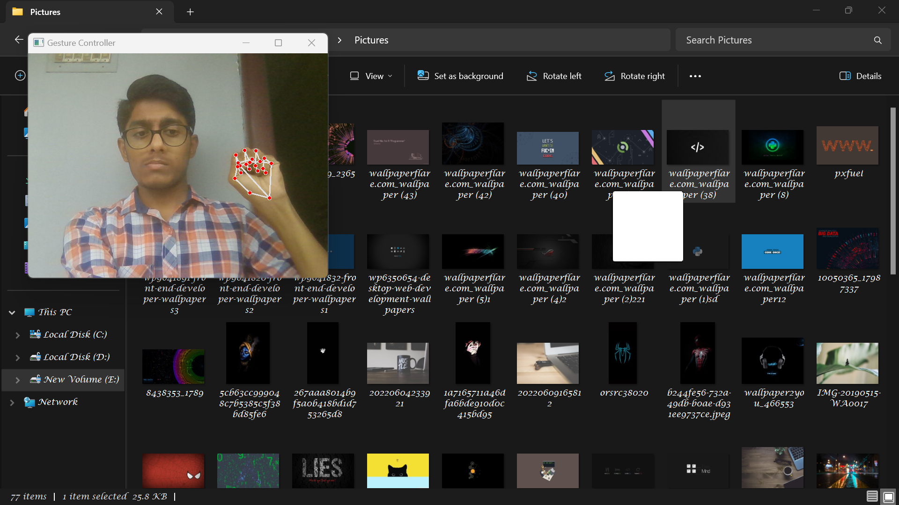
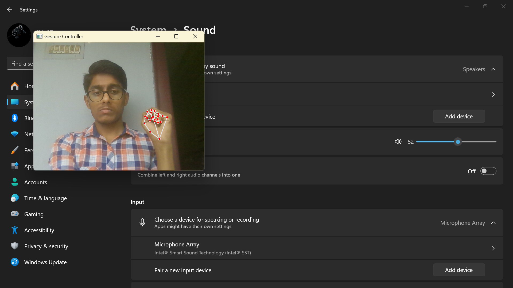
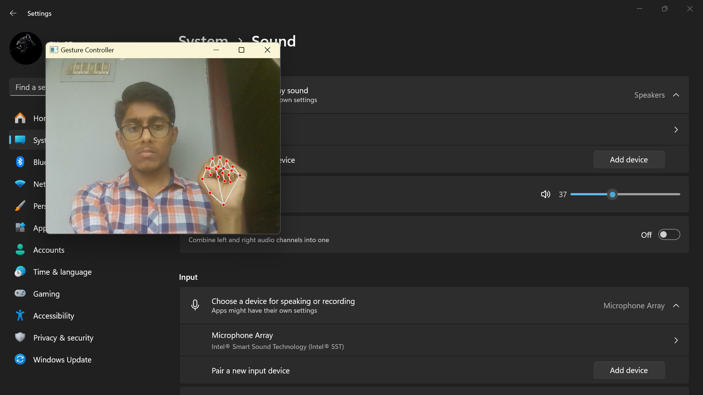

# Hand Gesture Controller

## Abstract

--> Hand Gesture Controller makes human computer interaction simple by making use of Hand Gestures.'

--> The computer requires almost no direct contact.

--> All Input and Output operations can be virtually controlled by using static and dynamic hand gestures.

--> This project makes use of the Machine Learning and Computer Vision algorithms to recognize hand gestures, which works smoothly without any additional hardware requirements.

--> It consists of one module which works direct on hands by making use of MediaPipe and OpenCV Hand detection which controls the mouse by detecting the user hand positions and it controls all the operations done by the mouse like Left click, Right Click, Double Click, Drag and Drop, Multiple Select and Volume Controller.

--> For all this implementation we use Python for developing the project. Currently it works on Windows platform.

## Activate Camera

## Activate Controller

## Double Click

## Drag n Drop

## Select

## Volume Increase

## Volume Decrease

## Problem Statement

Developing a gesture recognition system that can control a computer using hand gestures. 

This problem statement is clear, concise, and specific. It also has a well-defined objective: to develop a
gesture recognition system that can control a computer using hand gestures. The problem statement is
also feasible, meaning that it can be solved with existing technology and resources. Finally, the problem
statement is relevant, as gesture recognition technology has the potential to revolutionize the way we
interact with computers.

Here is a more detailed breakdown of the problem statement: 

• **Develop**: This implies that the goal is to create a new system, not to modify or improve an existing one.

• **Gesture** recognition system: This identifies the type of system being developed.

• **Control a computer**: This specifies the function of the system.

• **Using hand gestures**: This details the input method for the system.

## AIM 
To develop a hand gesture recognition system that can control a computer using hand gestures.

## OBJECTIVES:

• The system should be able to work on Windows platforms.

• To work smoothly and accurately, even in complex environments.

• The system should be able to control all of the mouse operations using hand gestures.

• To develop a machine learning and computer vision algorithm to recognize hand gestures.

• The system should be able to work smoothly and accurately, even in complex environments.

• To control all of the mouse operations such as left, right & double clicks, drag and drop, multiple select, 
and volume control.

## System Architecture and Design:

## System Development Approach 

Hand Gesture Controller that allows users to control a computer using hand gestures. It uses machine
learning and computer vision algorithms to recognize hand gestures and control all of the mouse
operations, such as left click, right click, double click, drag and drop, multiple select, and volume control.
The code also features the ability to adjust system brightness and perform horizontal and vertical scrolling.

### Algorithm:

The Hand Gesture Controller utilizes a combination of algorithms to achieve its functionality of Mediapipe,
Gesture Encoding, Hand Recognition, Controller,

### Deployment:

The code is designed for deployment on a local machine with a webcam. It utilizes the OpenCV library for 
video capture and frame processing. The Mediapipe Hands framework is integrated using its Python 
bindings.

To deploy the code, follow these steps:

• Install the necessary dependencies: OpenCV, Mediapipe, and PyAutoGUI.

• Run the provided Python script.

• Ensure a webcam is connected and accessible.

Thank you!❤️
